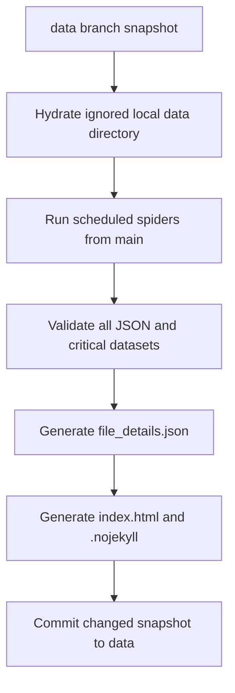

# Data publishing workflow

## Branch responsibilities

| Branch | Responsibility |
|---|---|
| `main` | Source, tests, tools, and documentation only; generated `data/` output is ignored and removed from history |
| `data` | Canonical generated dataset and static Pages files at branch root |

These are the only remote branches. GitHub Pages deploys from `data` / root.
Legacy `gh-pages`, `archive/*`, and migration branches have been removed after
transplanting the remaining migration source changes onto the cleaned `main`.

`main` history has been rewritten to remove `data/` and commits that only
updated that directory. Source changes are retained with new commit IDs.
The `data` branch is retained independently; cleaning `main` is not a
repository-wide purge of generated data.

Each workflow run creates an ignored local `data/` directory from the latest
`data` branch before crawling, and only the `data` branch receives
generated-data commits.

Existing clones must refresh `origin/main` and base new work on the rewritten
history. Do not merge the old `main` history back into the cleaned branch;
reapply any unpublished source changes onto the new history instead.

## Scheduled lifecycle



The workflow runs on pushes to `main`, every two hours, and manual dispatch.
Its concurrency group permits only one publisher at a time and does not cancel
an in-progress publication. It has only `contents: write` permission.

Data commits use `data(<changed-datasets>): update published snapshot`. Scopes
are sorted alphabetically and derived from the actual staged dataset diff. The
body records every changed path, with generated metadata listed separately. If
the staged tree is unchanged, the workflow creates no commit.

Hydration excludes `.git`, `.nojekyll`, `CNAME`, and `index.html`, while
retaining the previous `file_details.json` so unchanged datasets preserve their
meaningful `last_updated` values. Existing datasets are copied before crawling,
so a spider that does not run—or a library source that fails—does not erase its
previous published output. A preserved `CNAME` is restored during publication
if one is ever added to the `data` branch.

The regular spider set remains:

- `nthu_announcements_item`
- `nthu_buses`
- `nthu_courses`
- `nthu_dining`
- `nthu_libraries` (failure-isolated because upstream sites may reject hosted
  runner IPs)

Directory, maps, newsletters, announcement-list, and other legacy datasets are
preserved by hydration; Phase 1 does not expand the crawler schedule.

## Validation and metadata

`validate_data.py` rejects missing critical root datasets, empty JSON files,
and malformed JSON before publication. It validates generated
`file_details.json` in the final pass but does not count publishing metadata as
crawler data.

`generate_file_detail.py` hashes the exact bytes of each published data asset.
Unchanged hashes preserve their previous `last_updated`; changed and new files
receive an offset-aware Asia/Taipei timestamp. The top-level timestamp is the
newest meaningful file timestamp and therefore remains stable when no dataset
changes.

Publishing controls (`file_details.json`, `index.html`, `.nojekyll`, and
`CNAME`) are excluded from the inventory. For backward compatibility:

```text
last_commit == version == sha256
```

NTHU-Data-API treats `last_commit` as an opaque cache identity. It is no longer
necessarily a Git commit SHA. The generated index displays a SHA-256 prefix and
does not create Git commit links from content hashes.

## Dependency management

`pyproject.toml` and `uv.lock` are the only dependency sources.

```bash
uv sync
uv run pytest -q
uv run python -m scrapy crawl nthu_buses
```

CI uses Python 3.13, `astral-sh/setup-uv`, and frozen lockfile installs.

## GitHub Pages deployment

Pages is configured under **Settings → Pages → Deploy from a branch** with
branch **data** and folder **/ (root)**.

1. Confirm `data` contains the complete root-level snapshot.
2. Wait for deployment and verify <https://data.nthusa.tw/>.
3. Verify `/buses.json`, `/courses.json`, `/announcements.json`, and
   `/file_details.json`.
4. Verify NTHU-Data-API cache refresh behavior.
5. Wait for at least one scheduled crawl and confirm another normal commit can
   be pushed to `data`.

If repository rules later protect `data`, GitHub Actions must be permitted to
push without weakening unrelated protections.

## Rollback

If a published snapshot fails verification, pause publishing and restore a
known-good snapshot from `data` history as a new commit on `data`. Keep Pages
pointing at `data` / root, fix the crawler or publisher on `main`, and resume
publishing after verification. The legacy `gh-pages` and archive branches are
no longer available as remote rollback targets.

Do not restore old ancestry to the cleaned `main` branch.
